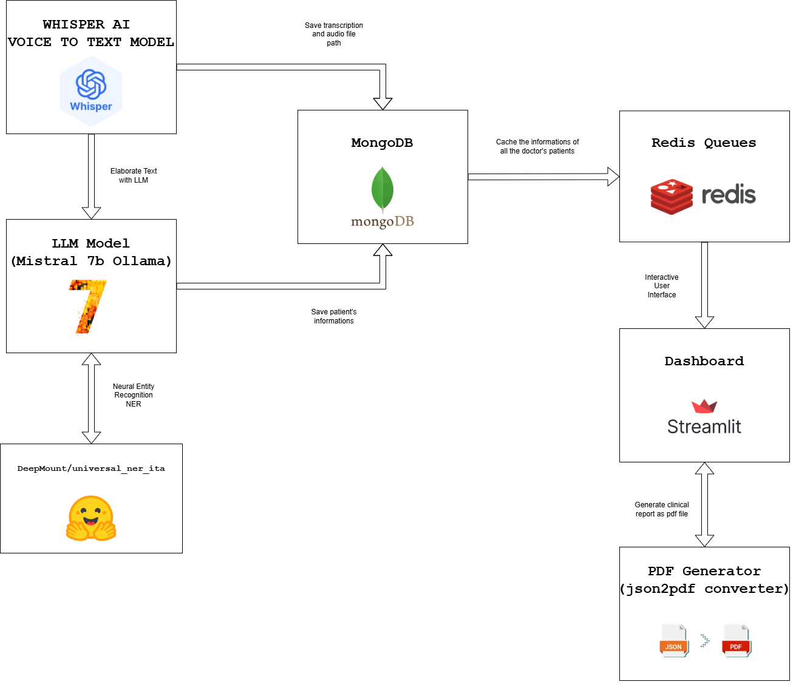

# Speech - 2 - Voice - Healthcare 

## Introduzione
La crescente necessità di strumenti digitali negli ambienti clinici ha stimolato lo sviluppo di soluzioni a supporto del personale sanitario nelle attività amministrative e di refertazione. Uno dei processi più critici e dispendiosi in termini di tempo è la creazione dei referti clinici.
Il progetto “Medical Voice-to-Text System for Clinical Report Automation” è stato sviluppato per semplificare e velocizzare il processo di compilazione dei referti clinici da parte del personale sanitario. Utilizzando l’elaborazione vocale (Whisper), modelli linguistici avanzati (Mistral 7B) e una struttura dati efficiente basata su MongoDB e Redis, il sistema consente di trasformare la voce dei medici in referti strutturati e modificabili.

## Sistema a supporto del personale sanitario
La documentazione clinica tradizionale si basa pesantemente sull’inserimento manuale da parte del personale medico, consumando tempo prezioso e introducendo il rischio di errori. Strumenti di trascrizione vocale sono stati adottati in alcuni contesti sanitari, ma molti mancano dell’accuratezza, del supporto linguistico e della comprensione contestuale necessari. Con l’avvento dei Large Language Models (LLM) e dei sistemi di riconoscimento vocale migliorati, è ora possibile costruire soluzioni più intelligenti, multilingue e integrate, che assistano il personale sanitario in tempo reale. Questo progetto affronta tali sfide combinando trascrizione, comprensione linguistica e gestione strutturata dei dati.

## Obiettivi
- Automatizzare la trascrizione vocale in testo medico.
- Generare report clinici coerenti, sintetici e strutturati.
- Permettere la modifica o cancellazione dei dati clinici
- Ridurre il tempo speso in attività burocratiche
- Migliorare l'accuratezza e la standardizzazione dei referti

## Architettura
