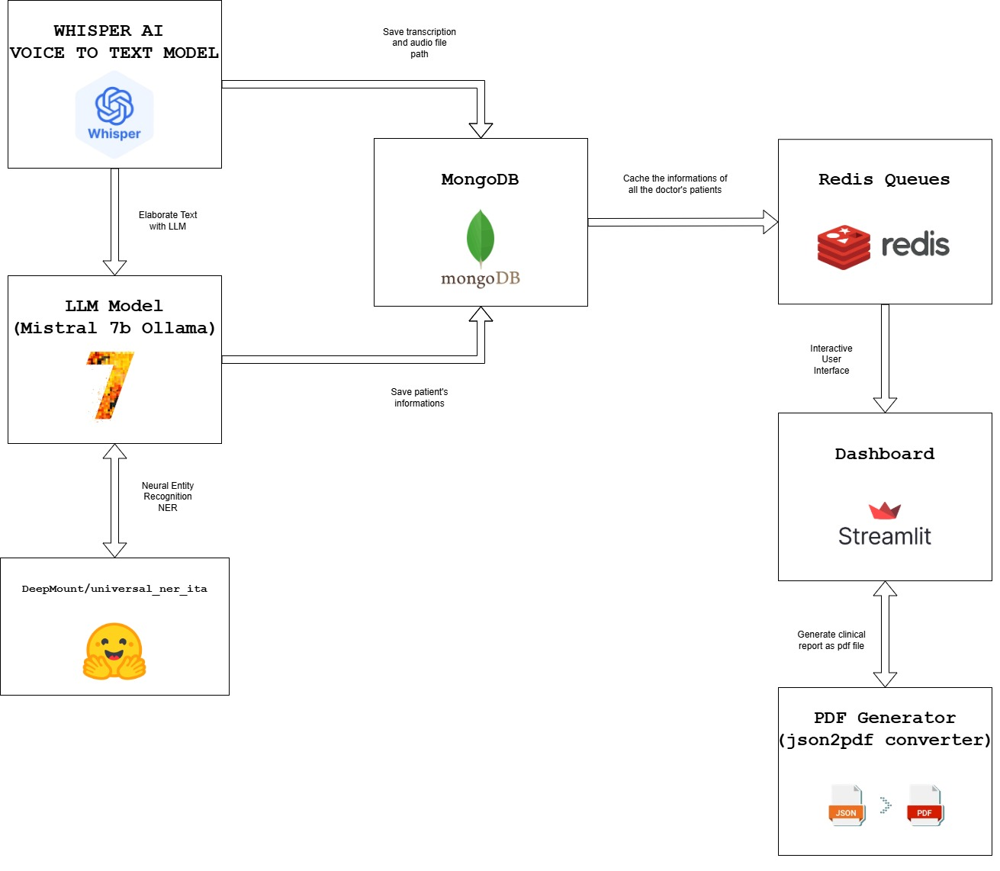

# Speech - 2 - Voice - Healthcare 

## Introduzione
La crescente necessità di strumenti digitali negli ambienti clinici ha stimolato lo sviluppo di soluzioni a supporto del personale sanitario nelle attività amministrative e di refertazione. Uno dei processi più critici e dispendiosi in termini di tempo è la creazione dei referti clinici.
Il progetto “Medical Voice-to-Text System for Clinical Report Automation” è stato sviluppato per semplificare e velocizzare il processo di compilazione dei referti clinici da parte del personale sanitario. Utilizzando l’elaborazione vocale (Whisper), modelli linguistici avanzati (Mistral 7B) e una struttura dati efficiente basata su MongoDB e Redis, il sistema consente di trasformare la voce dei medici in referti strutturati e modificabili.

## Sistema a supporto del personale sanitario
La documentazione clinica tradizionale si basa pesantemente sull’inserimento manuale da parte del personale medico, consumando tempo prezioso e introducendo il rischio di errori. Strumenti di trascrizione vocale sono stati adottati in alcuni contesti sanitari, ma molti mancano dell’accuratezza, del supporto linguistico e della comprensione contestuale necessari. Con l’avvento dei Large Language Models (LLM) e dei sistemi di riconoscimento vocale migliorati, è ora possibile costruire soluzioni più intelligenti, multilingue e integrate, che assistano il personale sanitario in tempo reale. Questo progetto affronta tali sfide combinando trascrizione, comprensione linguistica e gestione strutturata dei dati.

## Obiettivi
- Automatizzare la trascrizione vocale in testo medico.
- Generare report clinici coerenti, sintetici e strutturati.
- Permettere la modifica o cancellazione dei dati clinici
- Ridurre il tempo speso in attività burocratiche
- Migliorare l'accuratezza e la standardizzazione dei referti

## Architettura

Il sistema espone le seguenti funzioanlità principali:
- **Dashboard Streamlit**: Interfaccia web per la gestione di referti, ricerca, visualizzazione, modifica, download PDF e analisi temporale.
- **Registrazione audio**: Acquisizione referti tramite microfono direttamente dalla dashboard.
- **Trascrizione e generazione referti**: Pipeline automatica per la trascrizione e la generazione di referti strutturati.
- **Gestione utenti**: Amministratori e operatori con autenticazione e gestione anagrafica.
- **Backend API**: Servizi REST per la gestione dei dati e delle operazioni.
- **Controller**: Orchestrazione delle pipeline di trascrizione e generazione referti.
- **Database MongoDB**: Persistenza dei dati clinici.
- **Code Redis**: Gestione delle code di referti per i medici.
- **Containerizzazione completa**: Tutto il sistema è pronto per essere eseguito tramite Docker Compose.

## Guida all'installazione

### Metodo 1 (Consigliato): Docker
- **Clona il repository**
```
git clone https://github.com/AuroraD-99/Speech-2-Voice-Healtcare.git
```
- **Apri la repository apena clonata su github**
- **Apri il file entrypoint.sh e assicurati che EOL sia impostato su LF (in basso a destra, a fianco copilot)**
- **Se così non fosse, e c'è CRLF, allora selezionalo e cambia la EOL in LF**

- **Costruisci le immagini docker**
```
docker-compose build
```

- **Fai partire i container Docker**
```
docker-compose up -d
```

- **Ora il sistema è accessibile tramite la dashboard all'indirizzo lostalhost:8501**

### Metodo 2: installazione manuale
- **Prerequisiti**
 - Assicurati di aver installato i seguenti componenti
  - MongoDB
  - Redis
- **Clona il repository**
```
git clone https://github.com/AuroraD-99/Speech-2-Voice-Healtcare.git
```
- **Installa tutte le dipendenze**
```
pip install requirements.txt
```
- **Esegui in 3 shell diverse i seguenti comandi**
```
uvicorn backend:backend_app --host 0.0.0.0 --port 8001
```
```
uvicorn controller:app --host 0.0.0.0 --port 8003
```
```
streamlit run ./Dashboard/Dashboard.py --server.runOnSave=true
```
- **Attendi l'apertura dei due server uvicorn, dopodiché potrai iniziare ad utilizzare il sistema dalla dashboard streamlit**

## Autori
- [Aurora D'Ambrosio](https://github.com/AuroraD-99)
- [Gennaro Iannicelli](https://github.com/Gennaro2806)
- [Giuseppe Gatta](https://github.com/GiuseppeGatta)
